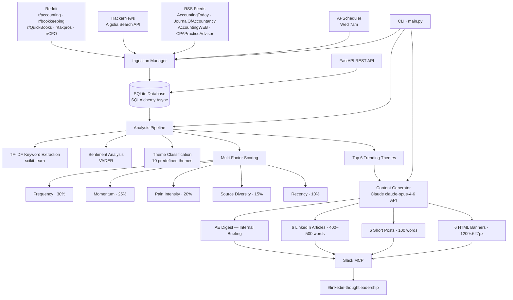
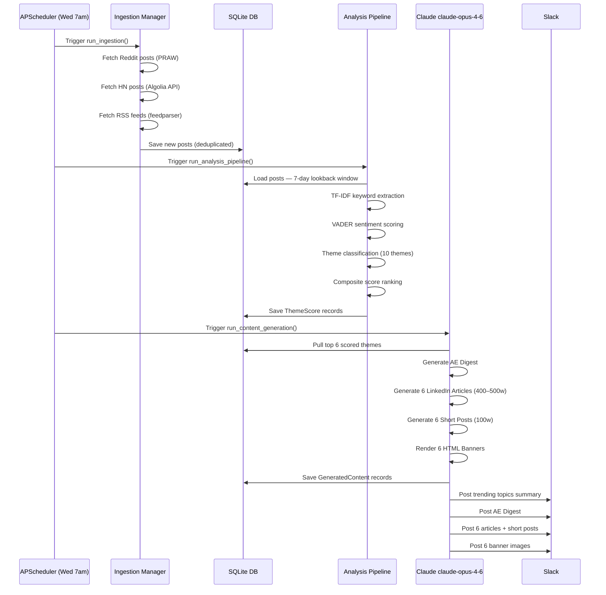

# GTM Intelligence — Accounting Thought Leadership System

> An internal AI system that monitors public accounting communities, extracts trending buyer topics, ranks them by pain intensity and momentum, and automatically generates non-salesy thought-leadership content published to Slack.

---

## Table of Contents

- [Overview](#overview)
- [Architecture](#architecture)
- [Pipeline Flow](#pipeline-flow)
- [Project Structure](#project-structure)
- [Scripts & Tools Reference](#scripts--tools-reference)
- [Setup & Installation](#setup--installation)
- [CLI Commands](#cli-commands)
- [Configuration](#configuration)
- [Scheduled Automation](#scheduled-automation)
- [Content Outputs](#content-outputs)
- [Tech Stack](#tech-stack)
- [Running Tests](#running-tests)
- [PowerPoint Deck Generator](#powerpoint-deck-generator)

---

## Overview

GTM Intelligence solves one problem: **AEs should know what buyers are struggling with before the call.**

The system runs weekly (Wednesdays at 7am), ingests posts from accounting communities (Reddit, HackerNews, RSS feeds), applies NLP scoring to surface the top 6 pain themes, then uses Claude AI to generate 6 LinkedIn articles, 6 short posts, and 6 visual banners — all posted automatically to Slack `#linkedin-thoughtleadership`.

**Built for:** "Placeholder Company" AI GTM / Marketing team  
**AI Model:** Claude claude-opus-4-6 (Anthropic) with adaptive thinking  
**Cadence:** Weekly automated runs + on-demand CLI  

---

## Architecture



---

## Pipeline Flow



---

## Project Structure

```
gtm-intelligence/
│
├── main.py                         # Entry point — loads .env, runs CLI
├── build-deck.js                   # PowerPoint deck generator (Node.js + pptxgenjs)
├── requirements.txt                # Python dependencies
├── package.json                    # Node.js dependencies (pptxgenjs)
├── pytest.ini                      # Test configuration
├── .env                            # API keys (not committed)
├── .env.example                    # Template for .env
│
├── config/
│   ├── settings.yaml               # App settings, scoring weights, model config
│   └── sources.yaml                # Reddit subreddits, HN queries, RSS feeds
│
├── src/
│   ├── ingestion/
│   │   ├── manager.py              # Orchestrates all ingestion sources
│   │   ├── reddit_source.py        # Reddit via PRAW
│   │   ├── hackernews_source.py    # HackerNews via Algolia API
│   │   ├── rss_source.py           # RSS feeds via feedparser
│   │   └── base.py                 # Base source class
│   │
│   ├── analysis/
│   │   ├── pipeline.py             # Full analysis orchestrator
│   │   ├── keyword_extractor.py    # TF-IDF extraction (scikit-learn)
│   │   ├── sentiment_analyzer.py   # VADER sentiment scoring
│   │   ├── theme_classifier.py     # Maps keywords → themes
│   │   ├── scorer.py               # Multi-factor composite scoring
│   │   └── themes.py               # 10 predefined accounting themes
│   │
│   ├── generation/
│   │   ├── content_generator.py    # Calls Claude API, saves to DB
│   │   └── prompts.py              # Prompt templates per content type
│   │
│   ├── storage/
│   │   ├── database.py             # SQLAlchemy async session + init_db()
│   │   └── models.py               # Post, Theme, ThemeScore, GeneratedContent
│   │
│   ├── api/
│   │   ├── main.py                 # FastAPI app init
│   │   ├── routes.py               # REST endpoints
│   │   └── schemas.py              # Pydantic schemas
│   │
│   ├── scheduler/
│   │   └── tasks.py                # APScheduler cron definitions
│   │
│   └── cli/
│       └── commands.py             # Click CLI: init, ingest, analyze, report, generate, serve
│
├── banners/
│   ├── banner1.html … banner6.html      # LinkedIn banner HTML templates (1200×627px)
│   ├── banner1.png  … banner6.png       # Rendered PNG exports
│   ├── capture_banners.py               # Screenshots HTML banners → PNG
│   ├── upload_banners.py                # Uploads banners to hosting
│   └── upload_catbox.py                 # Catbox.moe uploader
│
├── sample_outputs/
│   ├── ae_digest.md                # Sample AE briefing
│   ├── article_draft.md            # Sample LinkedIn article
│   ├── linkedin_post.md            # Sample short post
│   └── forum_post.md               # Sample forum reply
│
└── tests/
    ├── conftest.py                  # In-memory SQLite fixtures
    ├── test_analysis.py             # NLP pipeline tests
    ├── test_generation.py           # Content generation tests
    ├── test_ingestion.py            # Source ingestion tests
    └── fixtures/
        └── sample_posts.json        # Test data
```

---

## Scripts & Tools Reference

### Python Scripts

| Script | Purpose | Triggered By |
|--------|---------|--------------|
| `main.py` | CLI entry point — all commands route through here | `python main.py <cmd>` |
| `src/ingestion/manager.py` | Orchestrates Reddit + HN + RSS ingestion | `ingest` command |
| `src/ingestion/reddit_source.py` | Fetches posts from 8 subreddits via PRAW | Auto via manager |
| `src/ingestion/hackernews_source.py` | Fetches HN posts via Algolia Search API (no auth) | Auto via manager |
| `src/ingestion/rss_source.py` | Parses 6 accounting RSS feeds via feedparser | Auto via manager |
| `src/analysis/pipeline.py` | Full NLP analysis orchestrator | `analyze` command |
| `src/analysis/keyword_extractor.py` | TF-IDF n-gram extraction (1–3 grams, top 500 features) | Auto via pipeline |
| `src/analysis/sentiment_analyzer.py` | VADER compound sentiment → pain score | Auto via pipeline |
| `src/analysis/theme_classifier.py` | Assigns posts to 10 accounting themes | Auto via pipeline |
| `src/analysis/scorer.py` | Computes weighted composite scores | Auto via pipeline |
| `src/generation/content_generator.py` | Calls Claude claude-opus-4-6 API, saves content to DB | `generate` command |
| `src/scheduler/tasks.py` | APScheduler cron — full pipeline every Wednesday | `schedule` command |
| `src/api/routes.py` | FastAPI REST endpoints for themes, posts, content | `serve` command |
| `banners/capture_banners.py` | Screenshots HTML banners → PNG | Manual |

### Node.js Scripts

| Script | Purpose | Run With |
|--------|---------|----------|
| `build-deck.js` | Generates 12-slide PowerPoint summary deck | `node build-deck.js` |

---

## Setup & Installation

### Prerequisites

- Python 3.11+
- Node.js 18+ (for `build-deck.js`)
- Anthropic API key
- Reddit API credentials (optional but recommended)

### 1. Clone & Create Virtual Environment

```bash
git clone <repo-url>
cd gtm-intelligence

python -m venv .venv

# Windows
.venv\Scripts\activate

# macOS / Linux
source .venv/bin/activate
```

### 2. Install Python Dependencies

```bash
pip install -r requirements.txt
```

### 3. Install Node.js Dependencies

```bash
npm install
```

### 4. Configure Environment Variables

```bash
cp .env.example .env
```

Edit `.env`:

```env
# Required
ANTHROPIC_API_KEY=sk-ant-api03-...

# Optional — enables Reddit ingestion (8 subreddits, ~250+ posts/run)
REDDIT_CLIENT_ID=your_client_id
REDDIT_CLIENT_SECRET=your_client_secret
REDDIT_USER_AGENT=gtm-intelligence/1.0
```

> **Without Reddit credentials**, the system runs on HackerNews + RSS only (~5–10 posts/run).  
> **With Reddit**, you get 250+ posts/run across 8 subreddits — significantly stronger signal.

### 5. Initialize Database

```bash
python main.py init
```

---

## CLI Commands

```bash
# Initialize database and seed themes
python main.py init

# Ingest posts from all configured sources
python main.py ingest

# Run NLP analysis and score themes
python main.py analyze --lookback 7

# View ranked trending themes
python main.py report --top 10

# Generate content (all types)
python main.py generate --type all --top-n 6

# Generate specific content type
python main.py generate --type ae_digest
python main.py generate --type linkedin
python main.py generate --type forum
python main.py generate --type article

# Run full pipeline in one command (ingest → analyze → generate)
python main.py run-all --lookback 7 --top-n 6

# View latest generated content
python main.py show-content --type linkedin

# Start FastAPI REST server
python main.py serve --port 8000

# Start background scheduler
python main.py schedule
```

---

## Configuration

### `config/settings.yaml`

```yaml
ingestion:
  max_posts_per_source: 100
  lookback_days: 7
  request_delay_seconds: 2.0     # Rate-limit courtesy delay

analysis:
  tfidf_max_features: 500
  tfidf_ngram_range: [1, 3]
  top_keywords_per_post: 15
  min_theme_post_count: 2

scoring:
  weights:
    frequency: 0.30        # How often a topic appears
    momentum: 0.25         # Trending vs prior week
    pain_intensity: 0.20   # Emotional signal strength (VADER)
    source_diversity: 0.15 # Multi-platform appearance = higher confidence
    recency: 0.10          # Newer posts rank higher

generation:
  model: "claude-opus-4-6"
  top_themes_count: 5
  article_word_range: [600, 900]
  linkedin_max_chars: 3000
  forum_max_words: 400
```

### `config/sources.yaml` — Ingestion Sources

| Source | Channels |
|--------|---------|
| **Reddit** | r/accounting, r/bookkeeping, r/smallbusiness, r/taxpros, r/QuickBooks, r/xero, r/CFO, r/financialindependence |
| **HackerNews** | 9 keyword queries via Algolia API — no auth required |
| **RSS Feeds** | Accounting Today, Journal of Accountancy, AccountingWEB, CPA Practice Advisor, Going Concern, Insightful Accountant |

---

## Scheduled Automation

### Weekly Full Pipeline — Wednesdays at 7am

Managed via Claude Code's Scheduled Tasks MCP:

```
Trigger:   Every Wednesday at 7:00 AM PT
Pipeline:
  Step 1 — ingest    Fetch new posts from all sources
  Step 2 — analyze   NLP scoring on 7-day lookback
  Step 3 — generate  Claude produces 6 articles + 6 short posts + AE digest + 6 banners
  Step 4 — post      All content pushed to Slack #linkedin-thoughtleadership
```

### APScheduler (in-process)

```yaml
ingest_cron:     "0 */6 * * *"    # Every 6 hours — keeps DB fresh
analysis_cron:   "30 */6 * * *"   # 30 min after each ingest
generation_cron: "0 7 * * *"      # Daily at 7 AM
```

Run the in-process scheduler:
```bash
python main.py schedule
```

---

## Content Outputs

Each weekly run produces:

| Output | Format | Length | Where |
|--------|--------|--------|-------|
| AE Digest | Markdown | ~300 words | Slack (internal briefing) |
| LinkedIn Articles (×6) | Markdown | 400–500 words each | Slack → LinkedIn |
| Short Posts (×6) | Markdown | ~100 words each | Slack → LinkedIn |
| HTML Banners (×6) | HTML → PNG | 1200 × 627 px | Slack → LinkedIn |
| Summary Deck | `.pptx` | 12 slides | On-demand — `node build-deck.js` |

### Banner Design Specs

| Property | Value |
|----------|-------|
| Size | 1200 × 627 px (LinkedIn OG format) |
| Background | `#0A1628` dark navy |
| Accent | `#4A9EF5` blue |
| Font | Segoe UI / Arial |
| Format | HTML → PNG via headless capture |

---

## 10 Tracked Accounting Themes

| # | Theme | Slug |
|---|-------|------|
| 1 | AI & Automation in Accounting | `ai-automation` |
| 2 | Month-End Close & Reconciliation | `month-end-close` |
| 3 | Accounts Payable & Bill Pay | `ap-billpay` |
| 4 | Audit & Compliance | `audit-compliance` |
| 5 | Payroll Integration | `payroll-integration` |
| 6 | ERP & Software Integrations | `erp-integrations` |
| 7 | Cash Flow & Financial Reporting | `cash-flow` |
| 8 | Tax & Regulatory | `tax-regulatory` |
| 9 | Staffing & Capacity | `staffing-capacity` |
| 10 | Vendor Management | `vendor-management` |

---

## Tech Stack

| Layer | Technology | Version |
|-------|-----------|---------|
| Language | Python | 3.11+ |
| CLI | Click + Rich | 8.x / 13.x |
| Web API | FastAPI + Uvicorn | 0.115+ / 0.32+ |
| Database | SQLite (async) | SQLAlchemy 2.0 + aiosqlite |
| NLP | scikit-learn (TF-IDF) | 1.5+ |
| Sentiment | VADER Sentiment | 3.3.2 |
| AI Generation | Anthropic Claude | claude-opus-4-6 |
| Reddit | PRAW | 7.8+ |
| HTTP | httpx + aiohttp | 0.27+ |
| RSS | feedparser | 6.0+ |
| Scheduling | APScheduler | 3.10+ |
| Slack | Claude Code Slack MCP | — |
| Deck Generation | pptxgenjs (Node.js) | — |
| Testing | pytest + pytest-asyncio | 8.x |

---

## Environment Variables

| Variable | Required | Description |
|----------|----------|-------------|
| `ANTHROPIC_API_KEY` | ✅ Yes | Claude API key — required for content generation |
| `REDDIT_CLIENT_ID` | ⚠️ Recommended | Reddit app client ID — get from reddit.com/prefs/apps |
| `REDDIT_CLIENT_SECRET` | ⚠️ Recommended | Reddit app client secret |
| `REDDIT_USER_AGENT` | ⚠️ Recommended | Identifies your app to Reddit API |

---

## Running Tests

```bash
# Run all tests (uses in-memory SQLite — no setup required)
pytest

# Run specific test module
pytest tests/test_analysis.py -v
pytest tests/test_generation.py -v
pytest tests/test_ingestion.py -v

# Run with coverage report
pytest --cov=src --cov-report=term-missing
```

---

## PowerPoint Deck Generator

`build-deck.js` generates a 12-slide summary deck from any batch of weekly articles.

```bash
node build-deck.js
# Output: GTM-Intelligence-Article-Summary.pptx
```

**Deck structure:**

| Slide | Content |
|-------|---------|
| 1 | Title — GTM Intelligence: Accounting Thought Leadership |
| 2 | Overview table — 3 weeks · 18 articles · 6 themes |
| 3 | Theme: AI & Automation |
| 4 | Theme: Audit & Compliance |
| 5 | Theme: Month-End Close & Reconciliation |
| 6 | Theme: AP, Bill Pay & Vendor Management |
| 7 | Theme: Payroll Integration |
| 8 | Theme: ERP & Software Integrations |
| 9 | Theme: Cash Flow & Financial Reporting |
| 10 | Key Buyer Signals — AE-ready quotes |
| 11 | "Placeholder Company" AI Positioning — practitioner voice |
| 12 | Next Steps — pipeline schedule + action items |

**Design:**  `#0A1628` navy background · `#4A9EF5` blue accents · Calibri font · LAYOUT_16x9

---


